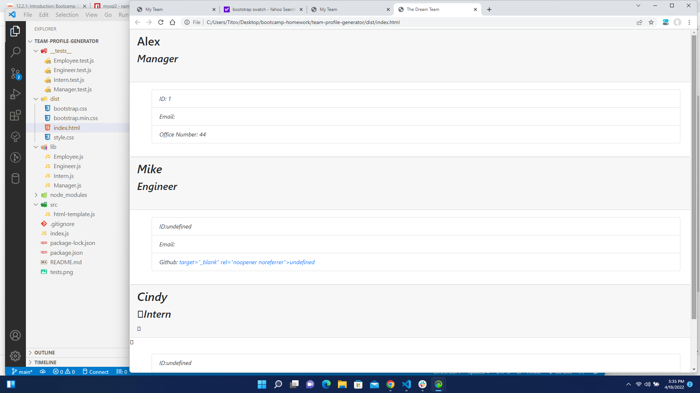
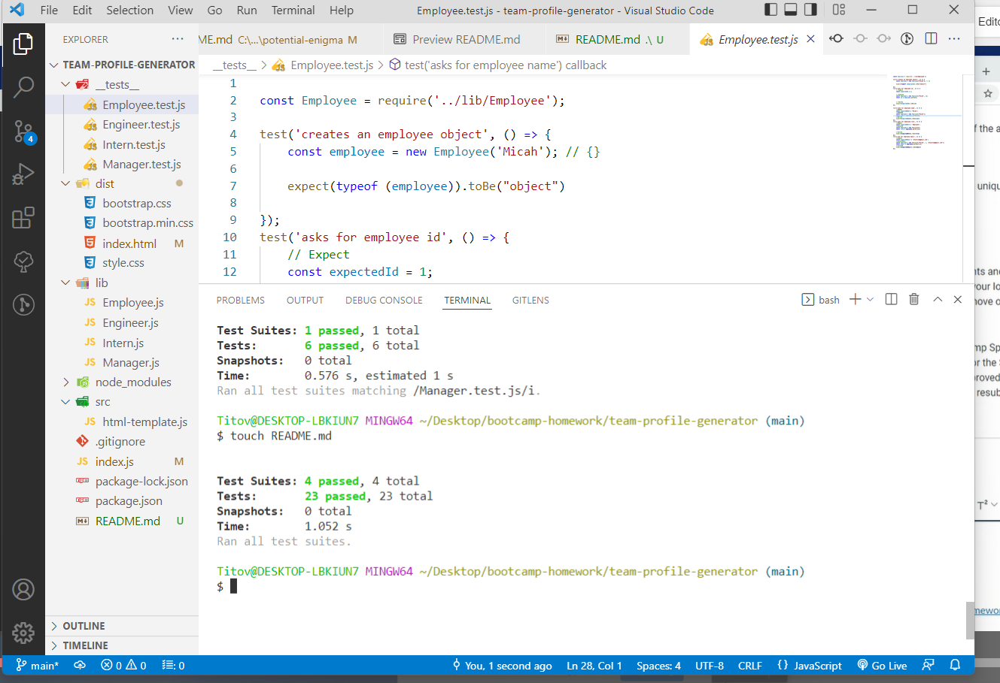

# Team Profile Generator::arrow_down: 
  [](https://opensource.org/licenses/Apache-2.0)
 
  
  > ## generate a list of employees on a team using Node in the command line
     - run tests for employees, engineers, interns, and manager(s).
     - an HTML is generated with IDs of all employees, along with names, roles, and/or email, Github usernames, schools, office numbers.
     
   


   ## Table of Contents::mag:
   1. [ Installation ](#installation)
   2. [ Usage ](#usage)
   3. [ License ](#license)
   4. [ Contributing ](#contributing)
   5. [ Tests ](#tests)

   ## Installation:

   To install dependancies, run the following commands:

     ```
     npm install
     ```
     ```
     npm i express
     ```
     ```
     npm i inquirer
     ```
     ```
     npm i jest
     ```
     
     To run NODE:
     
     ```
     node index.js
     ```


   ## Usage:
    
    For usage, please make sure to add comments and submit merge requests to Github.com.


   ## License: 
[Apache-2.0 license](https://opensource.org/licenses/Apache-2.0)


  

   ## Contributing:
   Please be kind and professional when adding to or accessing this repository. Thank you!
  [More on Contribution Guidelines](https://github.com/verokoles/readme-generator/blob/f57cf6a98bf276960885496059df4b039247c985/contributing.md)
  
   ## Tests:

     In order to run tests, use command:

   ```
   npm run test Employee.test.js
   ```
   ```
   npm run test Engineer.test.js
   ```
   ```
   npm run test Intern.test.js
   ```
   ```
   npm run test Manager.test.js
   ```
As shown below, all tests can be run together using 'npm run test':

  

   ## Questions?:raising_hand:
   

  ### Reach out via:

     Github: verokoles

     email: verokoles88@gmail.com


  [link to README tutorial video](https://drive.google.com/file/d/1IJNUEvzrQTFY1FLc3YM2U49ZVSUx2MzS/view)
